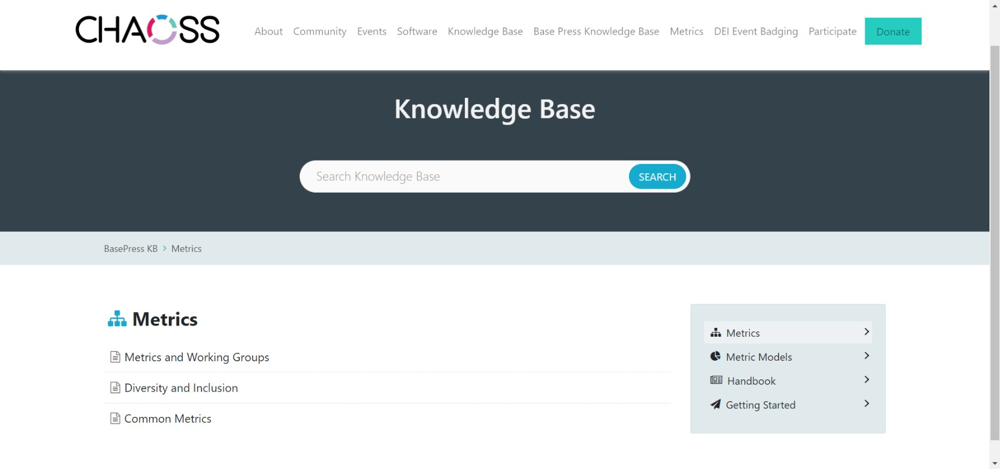

## Idea: [Build Knowledge Base application on CHAOSS](https://github.com/Akshaya101/community/blob/main/GSoC-Ideas.md#idea-build-knowledgebase-application-on-chaoss-website)

## Microtask 1:

Research Knowledge Base plugins for WordPress

After my research, I found 2 Knowledge Base plugins which would complement the current state of CHAOSS Website.
These plugins are:

- [BetterDocs](https://betterdocs.co/docs/wordpress/)
- [BasePress](https://wordpress.org/plugins/basepress/)

## Microtask 2:

Create a WordPress site. The site doesn't need to have real content but it should include dummy content (lorem ipsum...), navigation elements, and styling that complements the chaoss website.

## Microtask 3:

Implement two knowledgebase plugins (free versions) on your WordPress site. If you are recommending a plugin that costs money, please reach out to a mentor to discuss.

### Plugin 1 : BetterDocs

### Plugin 2 : BasePress

## Microtask 4:

Create a report to present the results of your micro-tasks 
and your proposal for implementing a knowledgebase on 
the CHAOSS website. Document the plugins and describe 
your design choices. 
Include links to your example implementations on 
your WordPress site.

### Creation of Website and Plugins used :
- As a part of the microtask, a WordPress website has to be created in order to implement plugins. 
- Two Knowledge Base plugins should be implemented in the site which I was able to achieve.

### Plugin 1 : [BetterDocs](https://betterdocs.co/docs/wordpress/)
- Better Docs is a WordPress Knowledge Base plugin that allows you to create an organised documentation page and improve user experience on your website.

- Advantages of BetterDocs
    - BetterDocs has user friendly documentation which makes it easier for anyone to use the plugin effectively. 
    - There are numerous templates that are available under BetterDocs which would help your website look prettier with minimal effort. 

- Pro Version of BetterDocs
    - Pro Version of Better Docs provides you with a Chat-bot live service where use FAQ’s can be answered instantly.
    - Allows you to implement multiple Knowledge Base plugins.
    - Provides features like advanced specific search.

### Plugin 2 : [BasePress](https://wordpress.org/plugins/basepress/)
- Basepress is a free to use Knowledge Base plugin that allows you to implement Knowledge Base faster.

- Advantages of Basepress
    - Straight forward implementation.
    - Arranges the articles in an easy-to-access manner

- Pro Version of Basepress
    - Advanced search bar results based on user votes and visits.
    - Knowledge Base Statistics.
    - Google reCATCHA feature to control spam from the feedback form.